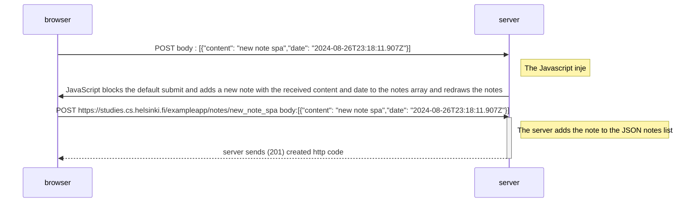

```mermaid
sequenceDiagram
    participant browser
    participant server

    browser->>server: POST body : [{"content": "new note spa","date": "2024-08-26T23:18:11.907Z"}] 
    Note right of server: The Javascript inje
    server->>browser: JavaScript blocks the default submit and adds a new note with the received content and date to the notes array and redraws the notes

    browser->>server: POST https://studies.cs.helsinki.fi/exampleapp/notes/new_note_spa body:[{"content": "new note spa","date": "2024-08-26T23:18:11.907Z"}] 
    activate server
    Note right of server: The server adds the note to the JSON notes list
    server-->>browser: server sends (201) created http code 
    deactivate server

```
