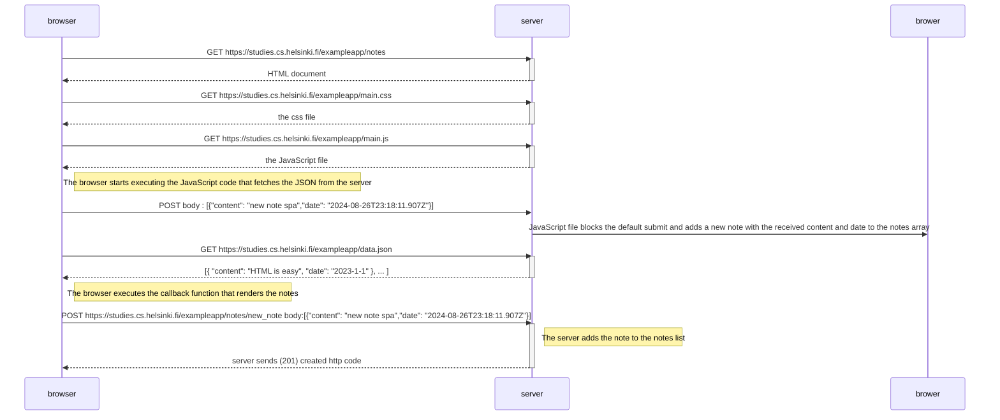

```mermaid
sequenceDiagram
    participant browser
    participant server

    browser->>server: GET https://studies.cs.helsinki.fi/exampleapp/notes
    activate server
    server-->>browser: HTML document
    deactivate server

    browser->>server: GET https://studies.cs.helsinki.fi/exampleapp/main.css
    activate server
    server-->>browser: the css file
    deactivate server

    browser->>server: GET https://studies.cs.helsinki.fi/exampleapp/main.js
    activate server
    server-->>browser: the JavaScript file
    deactivate server

    Note right of browser: The browser starts executing the JavaScript code that fetches the JSON from the server

    browser->>server: POST body : [{"content": "new note spa","date": "2024-08-26T23:18:11.907Z"}] 
    server->>brower: JavaScript file blocks the default submit and adds a new note with the received content and date to the notes array

    browser->>server: GET https://studies.cs.helsinki.fi/exampleapp/data.json
    activate server
    server-->>browser: [{ "content": "HTML is easy", "date": "2023-1-1" }, ... ]
    deactivate server

    Note right of browser: The browser executes the callback function that renders the notes

    browser->>server: POST https://studies.cs.helsinki.fi/exampleapp/notes/new_note body:[{"content": "new note spa","date": "2024-08-26T23:18:11.907Z"}] 
    activate server
    Note right of server: The server adds the note to the notes list
    server-->>browser: server sends (201) created http code 
    deactivate server

```