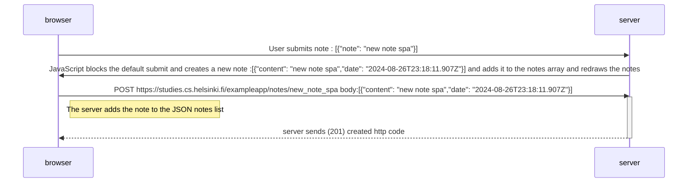

```mermaid
sequenceDiagram
    participant browser
    participant server

    browser->>server: User submits note : [{"note": "new note spa"}] 
    server->>browser: JavaScript blocks the default submit and creates a new note :[{"content": "new note spa","date": "2024-08-26T23:18:11.907Z"}] and adds it to the notes array and redraws the notes

    browser->>server: POST https://studies.cs.helsinki.fi/exampleapp/notes/new_note_spa body:[{"content": "new note spa","date": "2024-08-26T23:18:11.907Z"}] 
    activate server
    Note right of browser: The server adds the note to the JSON notes list
    server-->>browser: server sends (201) created http code 
    deactivate server

```